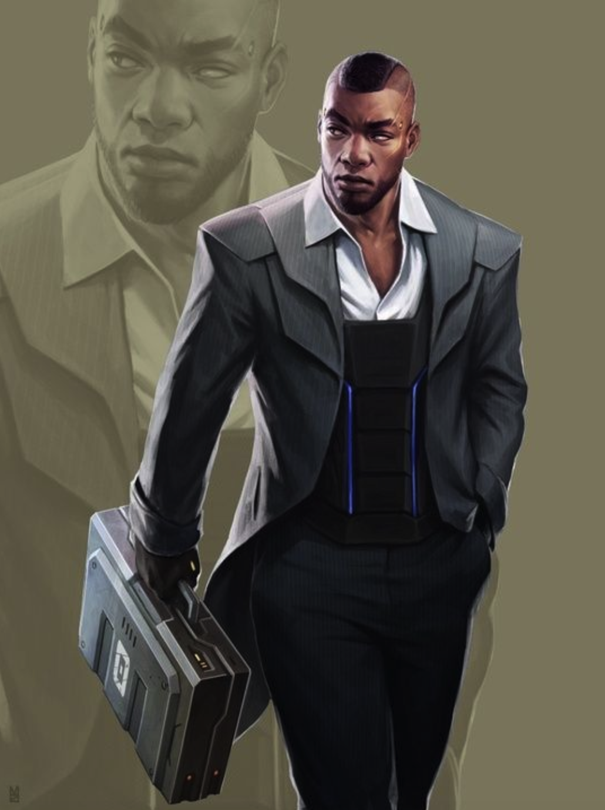

# Freemakers

Casted: As children, Freemakers are tested and sorted into what use you have to the state. Because of this, the Freemakers' social structure is based off use. The more useful you are to the State, the better taken care of you are. This effect creates a ton of animosity towards other Freemakers as well as any outsiders looking to supplant an industry. And yet comradery is built in industries. Miners like other miners. Politicians trust other politicians. However, every industry is willing to kill and destroy to ingratiate themselves to the state to keep life good and from slipping back into poverty.

Hyper Christianity: Religion makes up a significant part of a Freemaker's personality. They all believe the same core ideals of The Chosen, but often the organization of a groups religions has an extreme shift in practice. This leads to an ever further divide and distrust of different groups of Freemakers.

Punishers: Often the Freemaker people are more of a threat to each other than other nations are, so the law enforcement and the military act as one group. People that are sorted into the law enforcement are often more aggressive people allowing for a guiltless and extremely prejudiced enforcement of the law. Because their job in violence, and they are good at violence, the military is often at the top of the food chain and receives better State benefits.

Liberty Dying: When the Freemakers first set up their government, it was supposed to work like a revolvers magazine. It was meant to be filled and emptied quickly and efficiently. However, being in control of the nation quickly got to politicians heads and they began to twist the idea this rapid form of government, changing the laws to allow them to stay in power for life or until they abdicate or are physically unable to sit at the council table. Government leaders still change fairly quickly, but instead of it being the will of the people, its through criminal means and political espionage.

Another paragraph.

